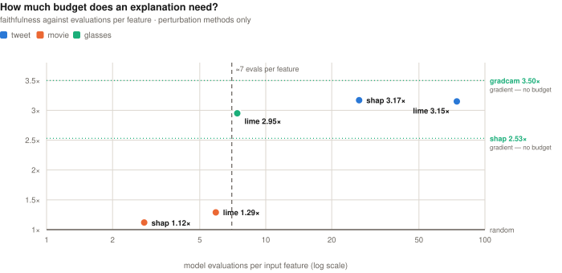
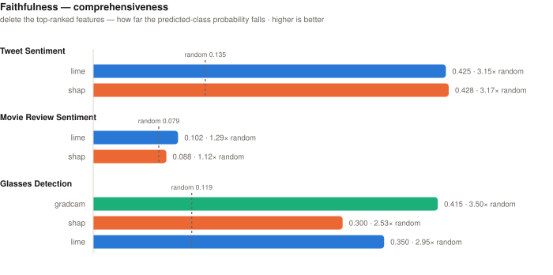
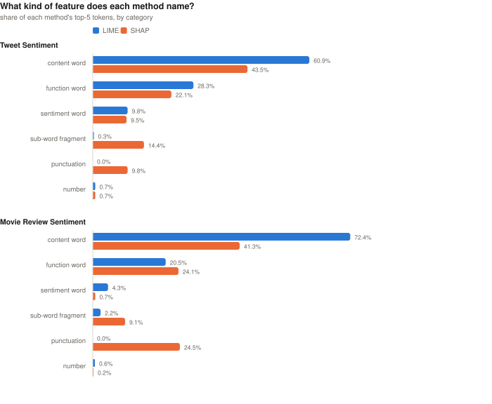

# Explainable AI across Text and Vision

**LIME, SHAP, prototype retrieval and Grad-CAM, applied to every prediction of three
classifiers — then ranked on whether the model actually uses what they name.**

5,561 predictions. 16,683 explanations. No sampling, no cherry-picking, and every figure
in the report recomputed from the artifacts on disk.

## What this found

**Perturbation-based explanation has a budget floor.** Below roughly **7 model evaluations
per input feature**, both LIME and SHAP fall to the performance of a random ranking of the
same features. The movie-review task sits at 5.9 and 2.8 — so its token explanations,
which cost 79 seconds and 39 seconds per review, are close to noise. The gradient-based
methods have no such floor: Grad-CAM records the highest faithfulness measured anywhere
here from a **single backward pass costing 0.03 s**.



**Plausible and faithful come apart.** On the image task, the method whose strongest pixel
most often lands inside the human-marked region — SHAP, 70.4% against the 4.4% a random
pixel achieves — is also the **least faithful of the three**. Its attribution mass is
scattered across 882 disconnected components; Grad-CAM's sits in exactly one. A reviewer
checking saliency maps by eye would be reassured by precisely the method they should trust
least.



## Headline results

| Task | n | Accuracy | Verdict | On what grounds |
|---|---|---|---|---|
| Tweet sentiment | 2,748 | 78.20% | **Tie** | SHAP leads LIME by 0.8% on comprehensiveness (3.17× vs 3.15× random) — inside the margin this project treats as indistinguishable |
| Movie reviews | 199 | 75.88% | **Neither** | Best method reaches 1.29× random. Both are close to noise |
| Glasses detection | 2,614 | 99.96%\* | **Grad-CAM** | Wins both faithfulness metrics (3.50× random), at 1/85th of LIME's cost |

\* over all 2,614 images, 1,830 of which the model trained on; held-out test accuracy is
100%. The comparison *between methods* is unaffected, but that figure should not be read as
a generalisation estimate.

Note what the verdicts are **not** based on. On tweets, LIME matches the human rationale
spans far better than SHAP (F1 0.640 vs 0.569) — and that does not break the tie, for the
reason below.

## How to read the claim

The model has already reached its conclusion. An explanation method's only job is to
account for **how that model got there**. Two different things get measured here, and only
one of them is evidence about the explainer:

| Measurement | Compares | What it establishes |
|---|---|---|
| **Faithfulness** *(primary)* | explanation ↔ **model** | Whether the explainer did its job. Delete what it named; does the prediction move? |
| **Plausibility** *(secondary)* | explanation ↔ **human** | Whether the *model* is human-like — a property of the model, seen through the explanation |
| Self-reported fit | explanation ↔ itself | Internal consistency only: surrogate R², convergence delta, neighbour agreement |

If a model latches onto something no human would, a *faithful* explanation reports exactly
that — and a human-agreement score penalises it for being correct. So plausibility is
reported throughout, because it is informative and because one of its results matters a
great deal, but it never decides a verdict.

Every faithfulness number carries a **random-ranking control** at matched budget. Deleting
*any* fifth of an input moves a classifier; only the margin over random is evidence that
the ordering carried information. That control is what exposes the movie result.

## Reproducing a single number

Grad-CAM's 3.50× on the glasses task:

```bash
python -m xai.faithfulness --task glasses
python - <<'PY'
import json
m = json.load(open("artifacts/faithfulness.json"))["glasses"]["methods"]
print(m["gradcam"]["comprehensiveness"] / m["random"]["comprehensiveness"])
PY
# 3.4962...
```

Every figure and table in the report is produced the same way — from a JSON artifact, not
from a number typed into the prose. The verdicts above are derived in code from
`faithfulness.json`, so re-running the analysis changes them rather than leaving them stale.

### What a clone can check without downloading anything

`artifacts/movie/predictions.jsonl` and `artifacts/glasses/predictions.jsonl` are tracked —
every attribution behind every figure for those tasks. From a bare clone, with no datasets
and no model weights:

```bash
python -m xai.behaviour --task movie    # recomputes the probes; reproduces them exactly
```

The tweet records are withheld on the licensing grounds described below, so that task is
checkable against the aggregate JSON rather than recomputable.

Inspecting any individual explanation works the same way — each line of the JSONL is one
prediction with its complete LIME, SHAP and prototype output.

Three things need more than the clone, and it is worth being clear about which:
`xai.faithfulness` re-runs inference and needs `models/`; `xai.evaluate` scores against the
human annotation in `Dataset/`; the glasses shape probe needs the 1 GB of saliency arrays.
Those are checkable against the tracked aggregate JSON rather than recomputable.

### Getting the data and the weights

Neither the datasets nor the model weights live in this repository, for two different
reasons.

**Datasets** are fetched from their original sources:

```bash
python scripts/get_data.py --check   # what's present, and each licence
python scripts/get_data.py           # fetch what's missing
```

The tweet corpus comes from a Kaggle competition whose rules state you may not
"transmit, duplicate, publish, redistribute or otherwise provide or make available the
Data". That is why **no tweet text appears in this repository** — including the
per-prediction records for that task, which would reproduce 2,748 test tweets and 5,569
training tweets verbatim. Aggregate statistics derived from the corpus are included, and
twelve tweets appear in the report as four worked examples with their retrieved
neighbours — quotation with analysis, which is what a paper does.

The movie data is Apache 2.0 and is the one corpus whose derived records are published in
full. The glasses dataset states no licence and its images are photographs of identifiable
people, so neither the images nor any saliency visualisation derived from them is
published here; the per-prediction records for that task carry file paths and numerical
attributions only.

**Weights** are on Hugging Face rather than here — it is built for them, and it keeps a
418 MB checkpoint out of git. Each carries a model card generated from
`artifacts/model_cards.json`, so it cannot disagree with this report. See `NOTICE` for the
attribution the upstream Apache 2.0 and BSD-3 licences require.

The image model needs neither: `python -m xai.train_glasses` reproduces it exactly in
about 26 minutes from a seeded stratified split.

## Tasks

| Task | Data | Model | Methods |
|---|---|---|---|
| Tweet sentiment | 2,748 test tweets, 3 classes | BERT-base, fully fine-tuned | LIME, SHAP, prototypes |
| Movie reviews | 199 test reviews, binary (counterfactually-augmented) | BERT-base + LoRA (r=8, α=32) | LIME, SHAP, prototypes |
| Glasses detection | 2,614 face images, binary | ResNet-18, ImageNet-initialised | Grad-CAM, SHAP, LIME |

## The models

All three were trained for this project. `python -m xai.modelcard` reads the facts back out
of the checkpoints — parameter counts and the LoRA breakdown from the loaded network, the
adapter settings from `adapter_config.json` — and re-scores every split rather than quoting
a number from training:

| | Tweet sentiment | Movie reviews | Glasses detection |
|---|---|---|---|
| architecture | BERT-base-uncased | BERT-base + LoRA | ResNet-18 |
| parameters | 109,484,547 | 109,780,228 | 11,177,538 |
| **trained** | **100%** (full fine-tune) | **0.27%** (295k adapter + 3k head) | **100%** |
| optimiser | AdamW, lr 5e-5 | not recorded | Adam, lr 1e-4, wd 1e-4 |
| epochs / batch | 3 / 16 | not recorded | 10 / 32 |
| train accuracy | 0.9715 | 0.7662 | 1.0000 |
| val accuracy | — | 0.7150 | 0.9974 |
| **test accuracy** | **0.7820** | **0.7588** | **1.0000** |
| generalisation gap | **+18.9 pp** | +0.7 pp | +0.0 pp |

Two things worth stating plainly. **The tweet model has an 18.9-point generalisation gap** —
it has memorised a large part of its training set, so an attribution there may faithfully
describe a decision that rests on memorisation rather than on a feature that transfers.
And the movie model's optimisation schedule is **genuinely unrecorded**: `adapter_config.json`
fixes the LoRA geometry, but the notebook in this repo loads that adapter rather than
producing it, so the epochs and learning rate are reported as unknown instead of guessed.

The image model is the only one this repo retrains (`python -m xai.train_glasses`), with a
seeded stratified split written to `artifacts/glasses/split.json`.

## Quickstart

```bash
python -m venv .venv && source .venv/bin/activate
pip install -r requirements.txt
brew install pango          # WeasyPrint's system libraries, for the PDF

python scripts/get_data.py       # fetch the three datasets from source (see below)
python -m xai.train_glasses      # retrain the image model with a seeded split (~26 min)
python -m xai.run --all          # explain every prediction (resumable, hours)
python -m xai.verify --all       # prove nothing is missing (exits non-zero if it is)
python -m xai.summarize --all    # aggregate into summary.json
python -m xai.modelcard --task all   # architecture, training provenance, per-split accuracy
python -m xai.evaluate  --task all   # plausibility vs the human annotation      
python -m xai.faithfulness --task all # deletion, against a random-ranking control
python -m xai.behaviour --task all    # what each method names; the budget analysis
python -m xai.report                  # HTML intermediate -> Report/ExAI_Report.pdf
```

Or end to end: `scripts/run_all.sh`. Set `PYTHONPATH=src` (or `pip install -e .`).

The four analysis steps are optional — without them `xai.report` still builds and simply
omits those chapters. Explaining everything takes hours; the runner appends each record to
disk the moment it completes, so interrupting is always safe and re-running resumes:

```bash
python -m xai.run --task tweet            # everything
python -m xai.run --task tweet --limit 20 # smoke test
python -m xai.run --task glasses --methods gradcam
```

## Layout

```
config.yaml              every path, seed, budget and training record — a run is
                         described by this file alone
requirements.txt         pinned; WeasyPrint also needs system pango (see Quickstart)
NOTICE                   third-party attribution, and the terms each dataset sets

src/xai/
  config.py              config loading, seeding, device selection
  data.py                all three datasets normalised onto one record shape
  models.py              unified wrappers exposing batched predict_proba
  explainers/            LIME, SHAP, prototypes (text) · Grad-CAM, SHAP, LIME (image)
  train_glasses.py       seeded, stratified retraining of the image model
  run.py                 orchestration — explain every prediction, resumably
  verify.py              completeness check over the written records
  summarize.py           aggregate records into task-level statistics
  modelcard.py           what each classifier is, how it was trained, how it scores
  evaluate.py            plausibility — explanations vs human annotation
  faithfulness.py        faithfulness — deletion vs a random-ranking control
  behaviour.py           what each method names; error detection; budget analysis
  figures.py             hand-written inline SVG, so figures stay sharp in the PDF
  render.py              per-prediction HTML cards and PNG panels
  layout.py              where every per-prediction output goes, and in what form
  restructure.py         migrate an older artifacts tree to the current layout
  report.py              assemble the document
  pdf.py                 HTML -> print-ready PDF via WeasyPrint
  explain_one.py         explain a single ad-hoc input, outside the batch pipeline

scripts/
  run_all.sh             the whole pipeline end to end
  resume.sh              pick up an interrupted run
  finish.sh              repair pass, kept from the original long run
  get_data.py            fetch the three datasets from their original sources
  make_hf_cards.py       generate Hugging Face model cards from the artifacts

artifacts/               model_cards.json, plausibility.json, faithfulness.json,
                         behaviour.json, summary_all.json   <- tracked; the report
                         is built from these, so every figure stays checkable
artifacts/<task>/        summary.json, predictions.jsonl, explanations/, saliency/
Report/ExAI_Report.pdf   the generated report
Report/figures/          the headline figures as standalone SVG, for this README
Report/hf/               generated Hugging Face model cards + upload.sh
```

## How the outputs are laid out

The output tree mirrors the input tree and preserves input order. Nothing is stored inside
an archive — a `.npz` is a zip file, which cannot be inspected, diffed or partially read
without unpacking it, so each attribution map is written as its own `.npy`:

```
Dataset/Glasses/image/neg/00012.jpg          input
└── artifacts/glasses/
    ├── explanations/neg/00012.html          readable card — panel + per-method stats
    ├── explanations/neg/00012.png           the saliency panel it embeds
    └── saliency/neg/00012/                  a directory, not an archive
        ├── gradcam.npy                      full 224×224, float16
        ├── shap.npy
        ├── lime.npy
        └── lime_segments.npy                int — the exact segmentation LIME used

Dataset/Tweet sentiment analysis/…/test.csv  input, row 42
└── artifacts/tweet/explanations/0042_5420d58af3.html
```

Text cards carry their input row number, so `ls` reproduces the order of the source CSV
rather than a hash order. **Every prediction in either modality is readable as HTML** —
images previously produced only a PNG, so the per-method numbers behind the picture were
visible only inside the JSONL.

Each task also gets `explanations/index.html`: every input listed **in input order**, one
column per method, linking to each card. It is how coverage is checked by eye rather than
by counting files — an absent or errored explanation shows up as a coloured cell:

| | tweet | movie | glasses |
|---|---|---|---|
| inputs | 2,748 | 199 | 2,614 |
| explanations each | LIME, SHAP, prototypes | LIME, SHAP, prototypes | Grad-CAM, SHAP, LIME |
| missing or errored | 0 | 0 | 0 |

Order is verified against the source files, not assumed: tweet and movie records match
their CSV row order exactly (movie after applying `char_limit`), and glasses ids sort to
the same sequence as the input image tree.

An artifacts tree from an earlier version converts in place, without recomputing anything:

```bash
python -m xai.restructure --dry-run   # report what would change
python -m xai.restructure             # unpack archives, rename, write the missing cards
```

## What gets saved

Nothing is truncated on disk. For **every** prediction the record holds a signed weight for
every word (LIME), a Shapley value for every token (SHAP), the k nearest training examples
with labels and agreement (prototypes), or the full 224×224 attribution map plus the
segmentation used (images) — so any explanation can be reconstructed exactly.

Each record also carries the model's full probability vector, the method's runtime, its own
reliability diagnostics, and a path to its rendered card. `config.yaml`'s `top_k_tokens`
affects only how many attributions are *drawn*; it never limits what is written.

`python -m xai.verify --all` re-reads everything and fails loudly if any sample is missing,
any method errored, any explanation came back empty, or any referenced file is absent:

```
=== glasses: PASS ===
  records 2614 / 2614 expected
  gradcam    present 2614   errored 0   empty 0
  shap       present 2614   errored 0   empty 0
  lime       present 2614   errored 0   empty 0

ALL TASKS COMPLETE
```

## What each method actually names

Composition of each method's top-5 tokens. LIME perturbs whole words, so it can never
return punctuation; SHAP works at wordpiece level and can. On the long movie reviews that
asymmetry becomes the story — **24.5% of SHAP's top tokens are punctuation, against 0.6%
sentiment words**, which is the same under-budgeting the faithfulness numbers expose.



## Why the rebuild

This replaces a notebook-based version that could not be re-run (uploaded checkpoints,
hardcoded paths, unseeded splits), and whose movie-review analysis described a **randomly
initialised classifier** — the LoRA adapter stores its fine-tuned head under
`base_model.model.classifier.*`, which `BertForSequenceClassification.from_pretrained`
silently ignores. `models.py` now loads via `PeftModel` and *asserts* the head matches the
checkpoint before any explanation runs. The report's "Corrections to the original report"
table lists the rest.

## Known limitations

- **Deletion is off-distribution.** Removing top-ranked features produces inputs the model
  has never seen, so a large probability drop conflates "the model relied on this" with
  "the model has never seen an input shaped like this". The random control absorbs much of
  that but not all — which is why comprehensiveness figures are compared with one another
  rather than read as absolute quantities.
- **Plausibility covers two tasks.** The movie dataset ships no human rationales. On tweets
  the human span is the whole tweet for most neutral examples; those are excluded, leaving
  a scored sample that is not class-balanced.
- **The budget threshold is a hypothesis, not a law** — five perturbation measurements, one
  metric, three tasks, declared rather than fitted.
- **The behavioural probes use hand-built word lists**, short enough to audit in full in
  `behaviour.py`, but neither exhaustive nor independently validated.
- **The glasses task is saturated** — 100% on its held-out set, so there are no failures to
  diagnose. A harder split would be more informative for XAI purposes.
- **Single seed.** LIME is stochastic; the distributions are stable but individual
  explanations should not be treated as exact.

### Provenance and contact

This work was produced as coursework. The datasets are used under the terms each
publisher sets, are **not redistributed here**, and are fetched from source by
`scripts/get_data.py`. `NOTICE` records the attribution the upstream Apache 2.0
and BSD-3 licences require, along with each dataset's terms.

Two exclusions are licensing decisions rather than size ones. The tweet corpus
may not be redistributed under the competition rules, so nothing reproducing it
appears here. The glasses dataset states no licence and its images are
photographs of identifiable people, so no saliency images derived from them are
published — the dataset is linked and credited instead.

If you are an author of a dataset or model used here and would like attribution
corrected or anything removed, please open an issue.

## Environment

Verified on macOS (Apple Silicon, MPS) with Python 3.14, torch 2.14, transformers 5.17.
Falls back to CUDA or CPU automatically via `config.yaml`'s `device: auto`.

## License

MIT — see [LICENSE](LICENSE).
